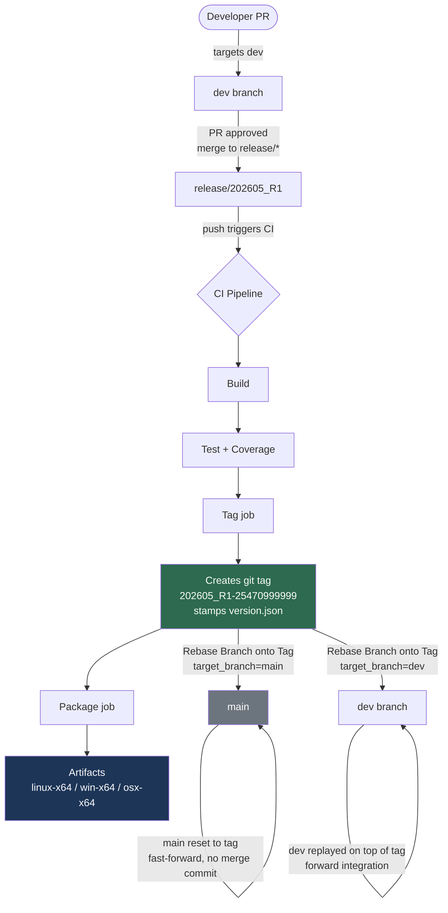

# Eximo CI/CD — Talking Points

## The Core Idea: Tags Are the Release

The entire release process is anchored to **git tags**, not branches. A tag represents a specific, immutable commit that has been built, tested, and published. Branches are just working surfaces — the tag is the artifact of record.

This means:
- "What version is running in production?" is answered by a tag name, not a branch state.
- You can always recreate the exact binary from the tag. No drift. No ambiguity.
- Rollback is trivial — point at a prior tag.

---

## Branch Roles Are Simple and Intentional

| Branch | Role |
|---|---|
| `dev` | **Default branch.** All developer PRs target `dev`. Where daily work happens. |
| `release/*` | Stabilisation surface. Created from a tag by a workflow. CI on this branch produces the next tag. |
| `main` | Convention mirror. Tracks the latest release tag. No direct commits, no PRs. It exists because teams and tooling expect it. |

**Key point for the room:** `main` is not where work happens and not where releases are made. It is a read-only pointer to the last known good tag. If it disappeared tomorrow, nothing in the process would break — but it stays because it's a familiar anchor.

---

## What CI Actually Does (and When)

**Every push and every PR** to `dev`, `main`, or any `release/*` branch runs build and test automatically. This gives fast feedback with no manual steps.

**Only on a push to a `release/*` branch**, two additional jobs activate:

1. **Tag job** — derives the build number from the branch name (e.g. `release/202605_R1` → `202605_R1-<run_id>`), stamps `version.json`, commits it back, and creates a permanent git tag.
2. **Package job** — runs in parallel for Linux, Windows, and macOS; publishes self-contained executables attached to the run.

**The CI can also be triggered on demand** against any branch from the GitHub Actions UI — useful when you've just created a release branch from a tag and want CI to run immediately without needing another commit.

---

## Three On-Demand Workflows Handle the Rest

| Workflow | What it does |
|---|---|
| **Create Release Branch** | Given a tag and a name, creates `release/<name>` from that tag. Kick off a hotfix or new stabilisation stream in seconds. |
| **Rebase Branch onto Tag** | Advances a branch to a tag. Handles two cases automatically: reset (for `main`, which has no unique commits) or rebase (for `dev`, which may have in-flight work). Uses `--force-with-lease` for safety. |
| **Build Eximo App** (CI) | All standard triggers plus manual — build and test any branch on demand. |

---

## The Complete Release Cycle in One Picture

---

## Why This Is Better Than Branching From `main`

- **No "merge to main to release" ceremony.** The tag is created by CI automatically when code lands on a release branch. There's no manual gate that can be skipped or forgotten.
- **`dev` never diverges far from the last release.** The rebase workflow forward-integrates dev onto the new tag after every release — keeping the gap small and rebases conflict-free.
- **Version metadata is always correct and traceable.** `version.json` is written and committed by CI, not by a developer, so the binary always knows exactly which tag, commit, and run produced it.
- **The pipeline is additive, not destructive.** The on-demand workflows use `--force-with-lease` — they protect against overwriting work that landed after the workflow was queued.

---

## Anticipated Questions

**"Why not just release from `main`?"**
Because `main` is a mirror, not a workspace. Releasing from a dedicated `release/*` branch means stabilisation work (final fixes, version bumps) is isolated from ongoing `dev` activity and is fully reproducible.

**"What if a rebase conflicts?"**
The workflow aborts and leaves the branch untouched. The operator resolves locally, then re-runs. Nothing is silently broken.

**"How do we do a hotfix?"**
Run Create Release Branch against the tag you want to patch. A new `release/202605_R1_hotfix1` branch is created. Apply the fix, push — CI tags it automatically.
